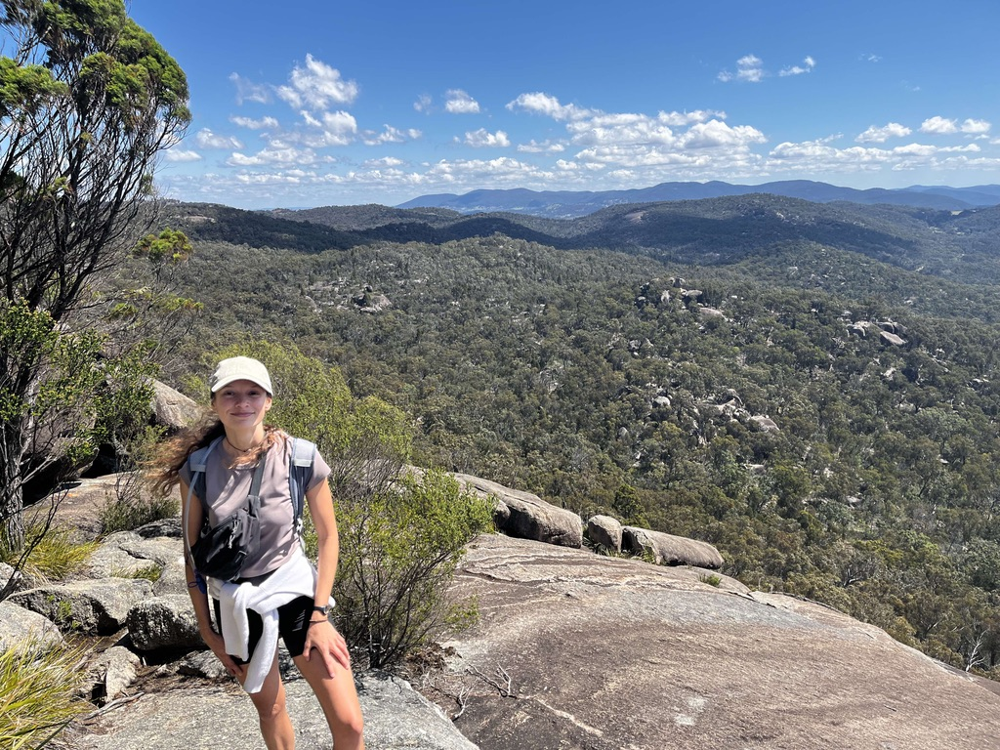

```{=html}
```

::: {.column .add-space width="52%"}
{fig-align="center" width="18cm"}
:::

::: {.column .add-space width="45%"}
Hi, I'm Zoe (she/her), a postdoctoral fellow at the Australian Institute of Marine Science. I recently finished my PhD at the University of Queensland, where I combined genomic data with ecological and environmental information to learn more about the evolutionary history and adaptive potential of Great Barrier Reef corals. I am particularly interested in using fundamental eco-evolutionary knowledge to predict the fate of climate-threatened species and populations under climate change, and to inform conservation efforts.

I grew up in the French Caribbeans, where I first fell in love with tropical coral reefs. I completed a Bachelor Degree at the Roscoff Research Station, where I discovered temperate marine critters, before pursuing the Erasumus Mundus master's degree in Evolutionary Biology. I was privileged to have a supportive family that prioritized education, and I care about increasing diversity in science.
:::

## Education and Research experience

**Postdoctoral fellow in Population Genomics and Bioinformatics** (2026 - present)\
Australian Institute of Marine Science (Australia)

**Postdoctoral fellow in Marine Population Genomics** (2025 - 2026)\
University of Queensland (Australia)

**PhD in Marine Population Genomics** (2021 - 2025)\
University of Queensland (Australia)

**MSc. in Evolutionary Biology (Erasmus Mundus MEME program)** (2017 - 2019)\
Uppsala University (Sweden)\
Ludwig Maximilian University (Germany)\
\
**BSc. in Biology and Mathematics** (2014 - 2017)\
Pierre and Marie Curie University at Roscoff Research Station (France)\
\
