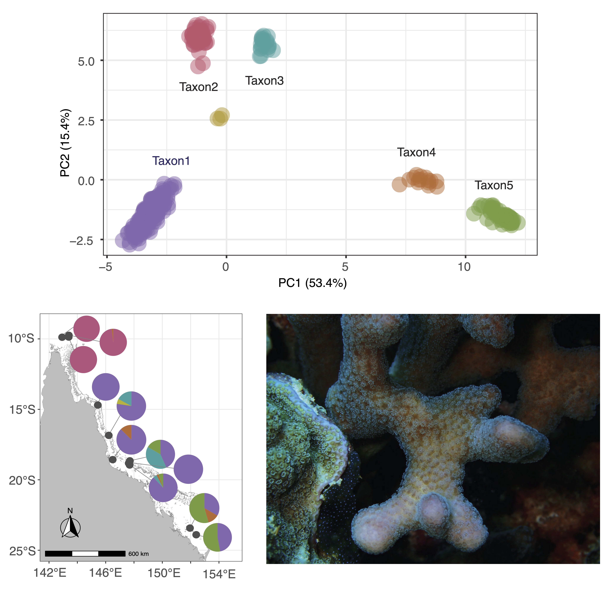
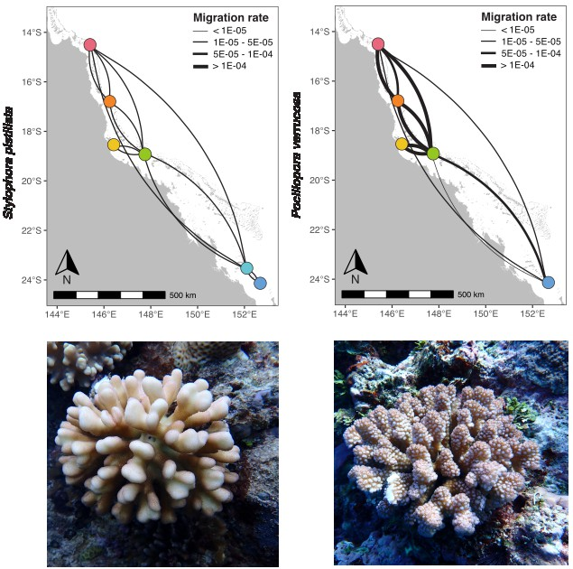
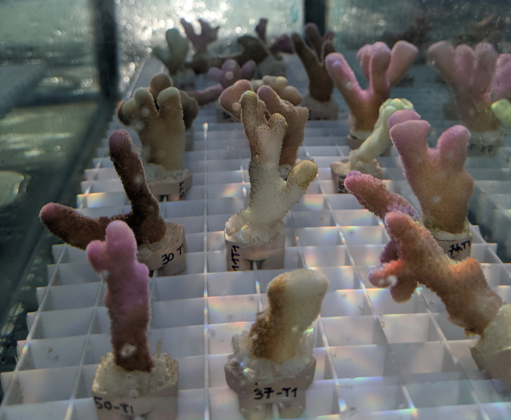

## Speciation in the *Stylophora pistillata* species complex

::: {#first-column layout="[30,70]"}
*Stylophora pistillata* is currrently taxonomically recognised as one nominal species, but using reduced representation sequencing data of 379 coral colonies, I discovered five distinct but sympatric taxa across the Great Barrier Reef. Demographic modelling (dadi) revealed that speciation events occurred with ongoing or episodic gene flow, resulting and that these five taxa are at different stages along a continuum of genetic divergence. Significant correlations between genetic divergence and environmental variables suggest that niche partitioning may have played a role in speciation in this species complex.

This work has been published in Evolutionary Applications - click [here](https://onlinelibrary.wiley.com/doi/full/10.1111/eva.13644) to read the full paper!
:::

::: {#second-column column.width="30%"}

{fig-align="right"}
:::

## Connectivity dynamics in co-distributed coral species

::: {layout="[30,70]"}
Connectivity is one of the most fundamental process driving the ecology and evolution of natural populations. Here, I investigated dispersal capacities and gene flow rates in two coral species: the brooding species *Stylophora pistillata* and the spawning species *Pocillopora verrucosa*. Using fine-scale spatial information and complementary approaches rooted in population genomics, I found that reproductive modes predict dispersal variance, with meter-scale dispersal in *S. pistillata* and kilometer-scale dispersal in *P. verrucosa*, which in turn affect long-term levels of gene flow and shape genetic diversity patterns across populations.

This work has been published in Science Advances - click [here](https://www.science.org/doi/10.1126/sciadv.adt2066) to read the full paper!
:::

::: {width="30%"}

:::

## Coral common garden experiment during a heatwave

::: {layout="[30,70]"}
During the summer of 2024, the Great Barrier Reef was hit by a fifth mass bleaching event, which particularly affected the Southern reefs. To investigate differences in heat stress response in the *Stylophora pistillata* species complex, I conducted a 3-month long common garden experiment at Heron Island Research Station. By combining weekly survival and health measurements with whole-genome sequencing data, the goal is to better disantangle how phenotype differences are shaped by species identity, intra-specific local adaptation, the environment and the symbiont community. I also plan to explore the genomic basis underlying differentiatl bleaching and survival responses. This work is in progress - stay tune!
:::

::: {width="30%"}
{width="10cm"}
:::
